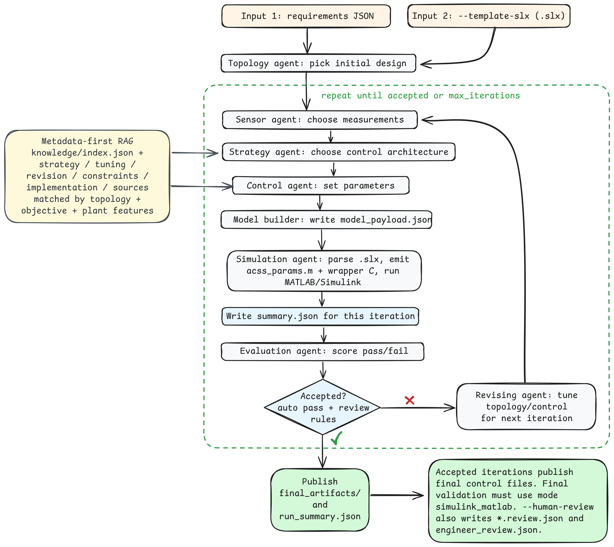

# ACSS Agentic AI Starter

Agentic workflow for Autonomous Control Synthesis System (ACSS), targeting MATLAB/Simulink power converter validation and controller artifact generation.



## Current workflow
Run input each time:
1. Requirements JSON (must include `design_prompt`)
2. Simulink template path (`--template-slx`)

Then ACSS does:
1. Topology agent: picks converter type and first L/C values.
2. Sensor agent: picks what to measure.
3. Strategy agent: picks the control style.
4. Control agent: sets `kp`, `ki`, and sample time.
5. Model builder: writes `model_payload.json`.
6. Simulation agent:
   - reads the `.slx` contract
   - emits `acss_params.m`
   - emits wrapper C file (for example `control_sfunc_wrapper.c`)
   - runs MATLAB/Simulink if available, else synthetic fallback
7. Visualization agent:
   - exports waveform plots for each iteration
   - exports inverter-focused three-phase voltage/current plots when waveform data supports it
8. Evaluation agent: checks limits and pass/fail.
9. If not passed, revising can change control structure and plant/controller settings, then repeats until `max_iterations`.

Runtime progress in terminal:
- ACSS now prints per-iteration progress with simple progress bars and step names.
- Long MATLAB-backed runs print simulation status so you can see that the workflow is still advancing.

Optional human-in-the-loop mode:
- Add `--human-review` to pause after topology, sensors, control strategy, control, simulation, evaluation, and post-revision outputs.
- At each pause, ACSS writes a `*.review.json` file for that step.
- Press `Enter` to accept the current result, type `e` after editing the JSON file to reload your changes, or type `q` to abort the run.
- After each evaluation, ACSS also writes `engineer_review.json` for the iteration.
- The engineer must edit that file and reload it with `e`.
- `engineer_review.json` records whether the round is good or bad, where the issues are, and what revisions should happen next.
- A round is accepted only when automated evaluation passes and the engineer approves it, unless `force_accept` or `force_revise` is used.

What `model_payload.json` means (plain words):
- It is the handoff package for that iteration.
- It bundles requirements + topology + sensors + control decisions in one file.
- The simulation step uses it to run the Simulink validation flow.

## Validation rule (important)
- Final pass currently requires validation mode `simulink_matlab`.
- Synthetic results (`--no-matlab`, MATLAB missing, or MATLAB fallback) are useful for smoke testing, but are not accepted as final validation.

## Prerequisites
- Python 3.10+
- Optional but recommended: MATLAB/Simulink available as `matlab` on `PATH`
- Run commands from repo root (`d:\AAI\ACSS`)
- Requirements JSON must include a non-empty text field: `design_prompt`

## Setup
```powershell
python -m venv .venv
& '.\.venv\bin\python.exe' -m pip install -r requirements.txt
```

If your local virtual environment is a non-standard layout and does not provide `.\.venv\Scripts\Activate.ps1`, run commands directly with:

```powershell
& '.\.venv\bin\python.exe' --version
```

## Run
MATLAB-backed run (recommended):
```powershell
& '.\.venv\bin\python.exe' -m src.main --requirements examples/requirements_buck_48to12_500w.json --template-slx examples/topology.slx --out runs
```

Synthetic smoke run (no MATLAB invocation):
```powershell
& '.\.venv\bin\python.exe' -m src.main --requirements examples/requirements_buck_48to12_500w.json --template-slx examples/topology.slx --out runs --no-matlab
```

Human-reviewed run (pause after each major step):
```powershell
& '.\.venv\bin\python.exe' -m src.main --requirements examples/requirements_buck_48to12_500w.json --template-slx examples/topology.slx --out runs --human-review
```

Explicit template override:
```powershell
& '.\.venv\bin\python.exe' -m src.main --requirements examples/requirements_inverter_3ph_grid_loadstep_template.json --template-slx examples/topology_inverter.slx --out runs
```

Flag summary:
- `--template-slx`: required on every run
- `--no-matlab`: skip MATLAB and use the synthetic simulator path
- `--human-review`: pause after each major workflow step and allow manual approval or JSON edits

## Requirements JSON
`--requirements` must point to a JSON file that includes a non-empty `design_prompt`.

Minimal example:
```json
{
  "name": "buck_48_to_12_500w",
  "design_prompt": "Design a robust 48V-to-12V buck converter control.",
  "vin_nominal_v": 48.0,
  "vout_target_v": 12.0,
  "pout_w": 500.0,
  "fsw_hz": 10000.0,
  "ripple_v_pp_max": 0.05,
  "settling_time_ms_max": 3.0,
  "overshoot_pct_max": 5.0,
  "efficiency_min_pct": 92.0,
  "max_iterations": 6
}
```

## Output layout
Each run creates `runs/<timestamp>_<requirements.name>/` with:
- `iter_XX/`
  - `model_payload.json`
  - `summary.json`
  - `*.review.json` files when `--human-review` is enabled
  - `acss_params.m`
  - `control_sfunc_wrapper.c` (or template module name)
- `waveforms.json` (synthetic) or `*_waveform.json` via MATLAB result
- `waveforms.svg` or `*_waveform.svg` preview images for quick inspection
  - `visualization_summary.json`
  - `waveforms_3ph.json` and `waveforms_3ph.svg` for inverter-oriented three-phase visualization
  - `matlab_result.json`, `matlab_stdout.log`, `matlab_stderr.log` when MATLAB is invoked
- `run_summary.json`
- `topology.review.json` in the run root when `--human-review` is enabled
- `engineer_review.json` in each iteration folder when `--human-review` is enabled
- `final_artifacts/` only if an iteration passes evaluation

`engineer_review.json` shape:
```json
{
  "iteration": 0,
  "requirements_name": "buck_48_to_12_500w",
  "auto_assessment": {
    "passed": false,
    "violations": ["overshoot_pct 7.5 > 5.0"],
    "score": 0.8
  },
  "strategy": {},
  "control": {},
  "simulation_metrics": {},
  "knowledge_refs": [],
  "engineer_review": {
    "approved": false,
    "overall": "bad",
    "good_points": [],
    "bad_points": ["Outer-loop transient is too aggressive"],
    "issue_locations": ["Voltage response near load step"],
    "revision_suggestions": ["Use cascaded current-mode control before increasing gains again"],
    "reviewer": "engineer_a",
    "notes": "Observed overshoot around the first transient.",
    "force_accept": false,
    "force_revise": true
  }
}
```

## Template behavior
`--template-slx` is required on every run. The orchestrator validates that the provided `.slx` exists before iteration starts.

The `.slx` parser extracts:
- `par.*` symbols used to build `acss_params.m`
- S-Function metadata (function/module names and I/O widths)

## Optional LLM strategy selection
`ControlStrategyAgent` uses rule-based selection by default.
If `DEEPSEEK_API_KEY` is set, it can use DeepSeek for strategy selection:
- `DEEPSEEK_API_KEY`
- Optional: `DEEPSEEK_MODEL` (default `deepseek-chat`)
- Optional: `DEEPSEEK_BASE_URL` (default `https://api.deepseek.com`)

## Local controller-design knowledge base
ACSS now uses a metadata-first local retrieval layer for controller-design guidance.

- Knowledge lives under `knowledge/` as structured JSON, not raw paper text.
- A local index is built lazily into `knowledge/index.json`.
- Retrieval is used by `ControlStrategyAgent` and `ControlAgent`.
- Retrieved references are stored in strategy outputs and control design artifacts.

Current knowledge folders:
- `knowledge/controllers/` and `knowledge/strategy/` for control-family selection rules
- `knowledge/tuning/` for loop-ordering and gain-direction rules
- `knowledge/revision/` for failure-driven revision rules
- `knowledge/constraints/` for sensing and operating-region constraints
- `knowledge/implementation/` for practical implementation guidance
- `knowledge/sources/` for paper/book/app-note metadata and linked claims

This remains intentionally lightweight:
- no external vector database
- no embedding dependency
- deterministic lexical retrieval plus metadata matching

Primary retrieval metadata now includes:
- `topic`, `topology`, `architecture`
- `power_stage_family`, `control_objective`, `operating_mode`
- `plant_features`, `revision_trigger`, `tags`
- `source_refs`, `confidence`

Knowledge document shape:
```json
{
  "title": "Buck PI Strategy Notes",
  "topic": "strategy",
  "topology": "buck",
  "architecture": "pi",
  "power_stage_family": "dc_dc_nonisolated",
  "control_objective": "voltage_regulation",
  "operating_mode": "standalone",
  "plant_features": ["load_transient"],
  "source_refs": ["example_source_id"],
  "confidence": "medium",
  "tags": ["load_step"],
  "sections": [
    {
      "heading": "When to use",
      "text": "Use a voltage-loop PI controller for straightforward buck regulation when bandwidth targets are moderate."
    }
  ]
}
```

Paper guidance:
- Do not upload large PDF corpora directly into the main retriever.
- Register papers under `knowledge/sources/`.
- Distill reusable engineering claims from papers into compact JSON entries under the topic folders above.
- Use raw PDFs as upstream evidence, not as the primary online retrieval format for ACSS decisions.

Local paper folder:
- Create a local `papers/` folder when you want to add private or large reference PDFs, for example `papers/voc/`.
- The repo ignores `papers/` by default, so local paper files are not pushed to git.
- If you add a new paper locally, also add a matching source metadata file under `knowledge/sources/` that points to the PDF path.

## Workflow diagram
- Editable source: `images/workflows/acss_workflow.excalidraw`

## Visualization outputs
ACSS now includes a dedicated visualization stage after simulation.

- For all runs, ACSS exports standard waveform previews such as `waveforms.svg`.
- For inverter runs, ACSS also exports `waveforms_3ph.svg` and `waveforms_3ph.json`.
- These plots are intended to make three-phase voltage and current behavior easier to inspect in a normal terminal-driven workflow.

Current behavior:
- Synthetic inverter runs generate phase-voltage and phase-current traces directly in `waveforms.json`.
- The visualization agent uses those traces to create three-phase plots.
- MATLAB-backed runs still depend on what the MATLAB export writes into waveform JSON; richer MATLAB waveform export can be extended further.

## Common errors
- Missing template path:
  - `main.py: error: the following arguments are required: --template-slx`
- Missing `design_prompt` in requirements:
  - `ValueError: requirements JSON must include non-empty 'design_prompt' field`
